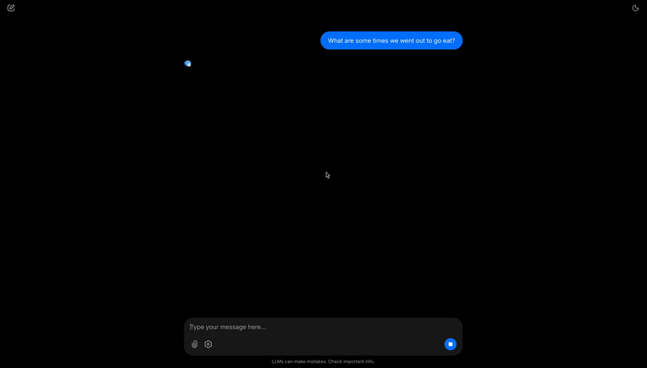
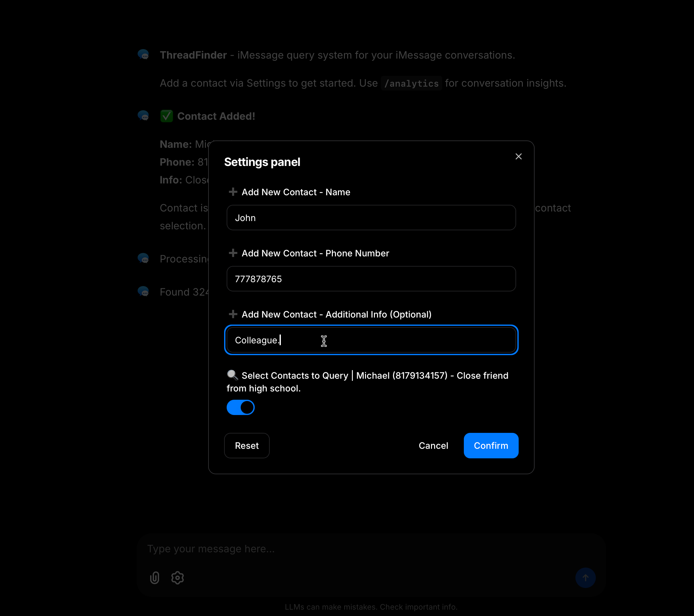

# RAG iMessage Query System with Conversation Disentanglement Model

Unlock the hidden knowledge buried in your messages with semantic search that lets you query, analyze, and explore your conversations like never before.

---

## Project Introduction

This project enables natural language search through your iMessage history by chunking conversations and using vector embeddings for semantic retrieval. Built entirely local-first, all data stays on your machine with no external API calls.

<div align="center">
  <table>
    <tr>
      <td align="center">
        <b>Query Demo</b><br/>
        
      </td>
      <td align="center">
        <b>Adding a Contact</b><br/>
        
      </td>
    </tr>
  </table>
</div>

---

## Table of Contents

- [💡 Overview](#-overview)
- [✨ Features](#-features)
- [🏗️ Architecture](#️-architecture)
  - [Conversation Chunking Algorithm](#conversation-chunking-algorithm)
  - [Contact-Based Partitioning](#contact-based-partitioning)
  - [Application Flow](#application-flow)
  - [ML Model Architecture](#ml-model-architecture)
- [Tech Stack](#tech-stack)
- [Getting Started](#getting-started)
  - [Prerequisites](#prerequisites)
  - [Installation](#installation)
  - [Running the Application](#running-the-application)
  - [Project Structure](#project-structure)
- [License](#license)

---

## 💡 Overview

RAGMessages is a powerful semantic search engine for your iMessage conversations, built using machine learning and vector embeddings. Designed to transform years of chat history into searchable knowledge, RAGMessages intelligently chunks conversations into threads and enables natural language queries to find specific discussions instantly. With a focus on privacy and performance, all processing happens locally on your machine.

## ✨ Features

- **Local-First Architecture**: All data stays on your machine, no external APIs
- **ML-Powered Chunking**: Neural network extracts conversation threads
- **Fast Semantic Search**: FAISS vector database enables sub-second retrieval across thousands of messages
- **Multi-Query Translation**: Generates multiple query variations to improve retrieval accuracy and recall
- **Contact-Based Partitioning**: Dedicated indexes for each conversation partner ensure faster, isolated searches
- **Interactive Chat Interface**: Chainlit-based UI for natural language queries and conversation discovery

## 🏗️ Architecture

### Conversation Chunking Algorithm

RAGMessages uses a sophisticated **three-stage chunking pipeline** to segment message streams into coherent conversation threads:

**Stage 1: Time-Based Segmentation**
- Identifies **bursts**: rapid message exchanges within 5-minute windows
- Groups bursts into **sections**: conversation segments within 30-minute windows
- Applies semantic similarity checks to merge sections separated by longer gaps
- Prevents artificial splitting of continuous conversations

**Stage 2: Micro-Thread Extraction**
- Uses a trained neural network to identify fine-grained conversation threads
- Compares adjacent bursts using embedding similarity (threshold: 0.26)
- Scores potential threads with weighted combination: `0.5 * mean_score + 0.5 * max_score`
- Deduplicates messages by assigning each to the highest-scoring thread

**Stage 3: Remainder Assignment**
- Handles orphan messages not initially assigned to threads
- Applies time decay function to weight recent connections more heavily: `1 / (1 + exp(0.0114 * (hours - 168)))`
- Inserts remainders chronologically into best-matching threads
- Ensures complete conversation coverage with zero message loss

### Contact-Based Partitioning

Each conversation partner gets a dedicated FAISS vector index:
- **Isolated Search Spaces**: Queries only search relevant conversations
- **Faster Retrieval**: Smaller indexes mean sub-second search times
- **Scalable Design**: Add new contacts without rebuilding existing indexes
- **Privacy-Preserving**: Each contact's data remains separate

### Application Flow

```
1. User Input
   └─ Enter contact phone number

2. Data Extraction
   └─ Query macOS chat.db (~/Library/Messages/chat.db)
   └─ Extract messages with flexible phone number matching
   └─ Decode attributedBody blobs for complete content

3. Conversation Processing
   └─ Apply three-stage chunking algorithm
   └─ Convert message tuples into conversation threads
   └─ Format threads with timestamps and sender labels

4. Embedding & Indexing
   └─ Embed threads using multi-qa-MiniLM-L6-cos-v1 (384-dim)
   └─ Create FAISS IndexFlatL2 for exact similarity search
   └─ Store index with metadata for retrieval mapping

5. Semantic Search
   └─ User submits natural language query
   └─ Generate multiple query variations via multi-query translation
   └─ Embed all query variations and search FAISS index
   └─ Aggregate and deduplicate results from all queries
   └─ Retrieve top-k most relevant conversation threads
   └─ Display results with context and timestamps
```

### ML Model Architecture

**Conversation Disentanglement Neural Network**

The ML model is integrated into the chunking pipeline to extract micro-threads from message bursts.

```
Input: Message Embeddings [batch_size, num_messages, 768]
   ↓
Self-Attention Layer:
   ├─ 4 attention heads learn message relationships
   │  └─ Temporal proximity, semantic similarity, speaker patterns, reply-to relationships
   └─ Residual connection: output = input + attention(input)
   ↓
Shared Backbone:
   ├─ Linear(768 → 256) + ReLU + Dropout(0.2)
   ├─ Linear(256 → 128) + ReLU + Dropout(0.2)
   └─ Linear(128 → 64)  + ReLU + Dropout(0.2)
   ↓
Dual Output Heads:
   ├─ Rank Head: Scores message relevance (ListNetLoss)
   └─ Keep Head: Binary inclusion decision (BCELoss)
```

**Training Details**
- **Dataset**: IRC Disentanglement Dataset (human-annotated chat logs)
- **Training Strategy**: Iterative thread prediction with teacher forcing
- **Optimizer**: Adam (learning rate: 0.001)
- **Configuration**: 30 epochs, batch size 5

**Performance Metrics**
- **Rank Head F1**: 0.809 (primary thread predictor)
- **Keep Head F1**: 0.549 (false positive filter)
- **Combined Specificity**: 0.799 (accurately excludes non-thread messages)

**Integration**
- Embedded in `chunk_algorithm/micro_thread.py`
- Processes bursts to identify conversation threads
- Handles interleaved conversations and multi-topic exchanges
- Enables accurate thread extraction without rule-based heuristics

---

## Tech Stack

### Backend

**Data Extraction**
- **SQLite3**: Direct integration with macOS iMessage database
- **Python 3.8+**: Core data processing and pipeline orchestration

**Chunking & Processing**
- **SentenceTransformers**: Message embedding for similarity calculations
  - Chunking model: `all-MiniLM-L6-v2` (384-dim)
  - RAG model: `multi-qa-MiniLM-L6-cos-v1` (384-dim, asymmetric search optimized)
- **PyTorch**: Tensor operations for embedding comparisons
- **NumPy**: Numerical computations for time decay and scoring

**Vector Search**
- **FAISS**: High-performance vector similarity search
  - Index type: `IndexFlatL2` (exact L2 distance)
  - Per-contact index architecture

### Frontend

**User Interface**
- **Chainlit**: Interactive chat interface for queries and results
- **Markdown Rendering**: Formatted conversation thread display

### Dependencies
```
torch>=2.0.0
sentence-transformers>=2.2.0
faiss-cpu>=1.7.4
chainlit>=1.0.0
numpy>=1.24.0
scikit-learn>=1.3.0
```

---

## Getting Started

### Prerequisites

- **macOS**: Required for access to iMessage database
- **Python 3.8+**: Core runtime environment
- **Full Disk Access**: Terminal needs permission to read chat.db

### Installation

```bash
# Clone the repository
git clone https://github.com/prestonrank/RAGMessages.git
cd RAGMessages

# Install dependencies
pip install -r requirements.txt

# Grant Full Disk Access
# 1. Open System Settings → Privacy & Security → Full Disk Access
# 2. Add Terminal (or your terminal emulator)
# 3. Restart terminal
```

### Running the Application

```bash
# Launch the web interface
cd chainlit_app
chainlit run app.py

# Navigate to http://localhost:8000
# Enter contact phone number and start querying
```

### Project Structure

```
RAGMessages/
├── data/
│   ├── processing/
│   │   ├── message_loader.py      # SQLite database interface
│   │   ├── file.py                # Message formatting utilities
│   │   └── test_data.py           # Sample conversation data
│   └── raw/
│       └── chat.db                # macOS iMessage database
│
├── chunk_algorithm/
│   ├── chunking.py                # Main orchestrator
│   ├── topic_shift.py             # Stage 1: Time-based segmentation
│   ├── micro_thread.py            # Stage 2: ML-powered thread extraction
│   ├── remainder.py               # Stage 3: Orphan assignment
│   └── similarity.py              # Embedding similarity utilities
│
├── rag/
│   ├── rag.py                     # FAISS indexing and retrieval
│   ├── app.py                     # Chainlit UI
│   └── main.ipynb                 # Experimental notebook
│
├── model/
│   ├── CD_model.py                # Neural network architecture
│   ├── training_loop.py           # Training logic with teacher forcing
│   ├── loss_function.py           # ListNetLoss implementation
│   ├── dataset_utils.py           # IRC dataset loading
│   └── construct_tree.py          # Message tree construction
│
└── proj_docs/
    ├── proj_doc.md                # Development history
    ├── algorithm_doc.md           # Detailed chunking approach
    └── baseline.md                # Baseline comparison
```

---

## License

MIT License - See LICENSE file for details.

### Citation

If you use this work in your research or projects, please cite:

```bibtex
@misc{ragmessages-2025,
  author = {Preston Rank},
  title = {RAGMessages: Semantic Search for iMessage Conversations},
  year = {2025},
  publisher = {GitHub},
  url = {https://github.com/prestonrank/RAGMessages}
}
```
